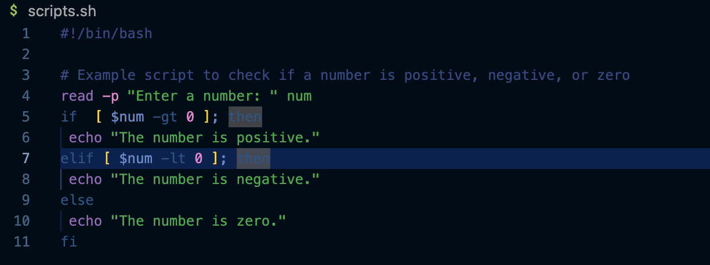
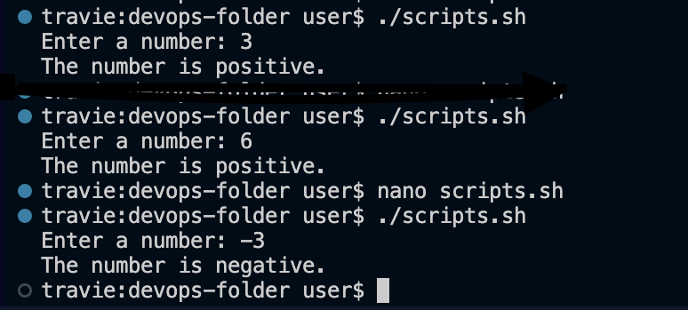
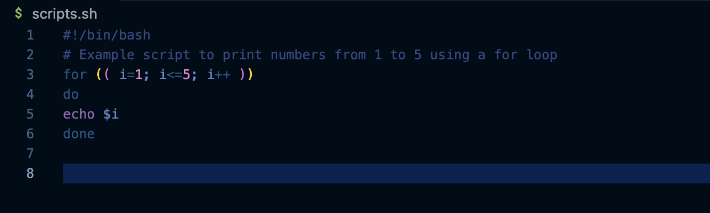
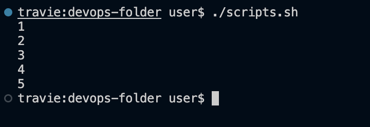

# Intro to SHELL-SCRIPTING & USER-INPUT
* Shell scripting is a super handy way to automate tasks using commands in a Unix/Linux shell. 

* Shell scripting basically deals with writing a series of commands in a text file that can be executed in a shell.

* Shell scripting allows automation of repetitive tasks, perform system administration tasks, and create complex workflows. 

* Shell scripting Uses variables, loops, conditionals, and functions to make your scripts more powerful and flexible. 
* It's a great skill to have as a DevOps Engineer, as it can help you streamline processes and save time.

## SS (Shell Scripting) Syntax.

* Working with **Variables**: Variables can store data of various types such as numbers, strings, and arrays. You can assign values to variables using the = operator, and access their values using the variable name
preceded by a $ sign.

   - Assigning value to a variable: name="John" 
   - Retrieving value from a variable: echo $name

 * Working with **Control Flow**: These statements allow you to make decisions, iterate over lists, and execute different
commands based on conditions. Statements like *if-else* for loops, and and case statements to control the flow of execution in your scripts.

* Using if-else to execute scripts on different conditions. 
* This code asks you to enter a number and then displays whether it's positive or negative.

* The result on the local machine is as follows.

* Using as a loop to create a list

* The result on the local machine is as follows.

## USER INPUT
* **Input and Output**: Bash provides various ways to handle input and output. 
* You can use the read command to accept user input, and output text to the console using the echo command.
* Additionally, you can redirect input and output using
some operators.
* Example - Accept User Input:
  - `echo "Enter your name:"`
  - `read name`
* Example - Output text to terminal:
  - `echo "Hello World"`
* Example - Out the result into a file
  - `echo "hello world" > index.txt`
* Example - Pass the file content as input to a command
  - `grep "pattern" < input.txt`
* Example - Pass the result of a command as input to another command
    - `echo "hello world" | grep "pattern"`

* Working with **Functions**: Functions provide a way to
modularize your code and make it more reusable.
* You can define functions using the function keyword or simply by declaring the function name followed by parentheses.

* The Result is as Follows:

