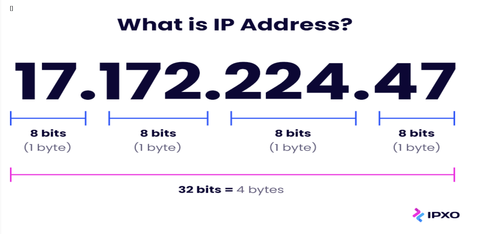
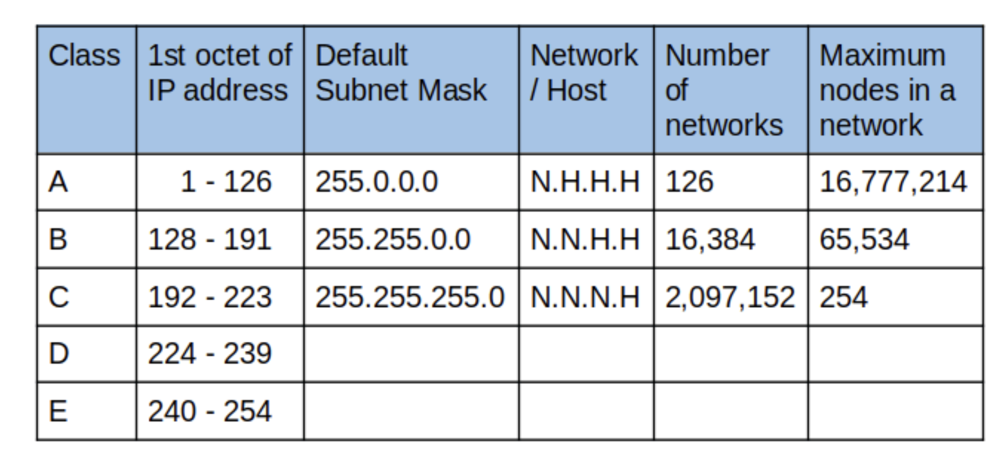
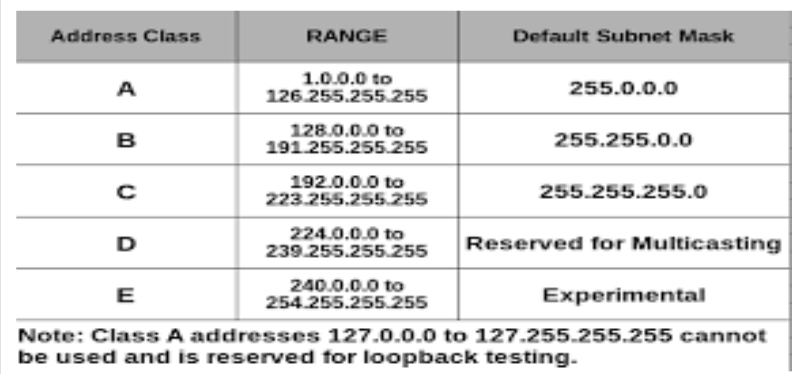

# Understanding IP Addresses and CIDR Notation

# Introduction To IP Addresses

### Understanding Subnetting and Subnet Masks

### Understanding CIDR Notation and Address Aggregation

### Understanding IP Address Classes and Private IP Address Ranges

### Understanding each of the IP Addresses Network Class in Detail

### Understanding Advanced Topics in IP Addressing

### Understanding VPNs & QoS

### Understanding DNS & NAT

